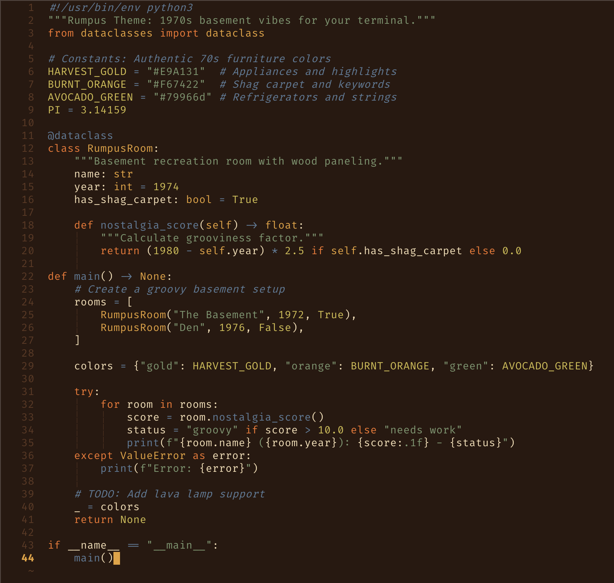

# Rumpus

A warm, earthy terminal color scheme inspired by 1970s rumpus rooms and mid-century modern design aesthetics.



## Features

- 🟤 **Authentic 70s palette** - Harvest gold, avocado green, burnt orange, and walnut
- 🪵 **Furniture-inspired** - Based on iconic wood paneling and appliances, not sci-fi or neon
- 🎨 **Period-accurate** - Colors that intentionally "clash" in that distinctive 70s way
- 🔧 **Multi-tool support** - Ghostty, Zellij, tmux, Fish shell, Zsh shell, Delta, Bat, Helix, Zed, Neovim, iTerm2, VS Code
- 📚 **Well-documented** - Complete ANSI color mapping

## Color Palette

### Primary Colors

| Color | Hex | RGB | Usage |
|-------|-----|-----|-------|
| Walnut | `#2A1810` | `42 24 16` | Primary background |
| Chocolate Brown | `#5F3822` | `95 56 34` | Secondary background, dark accent |
| Tan/Beige | `#F4DDB3` | `244 221 179` | Primary text |
| Harvest Gold | `#E9A131` | `233 161 49` | Highlights, active elements |
| Burnt Orange | `#F67422` | `246 116 34` | Emphasis, keywords |
| Avocado Green | `#79966d` | `121 150 109` | Success, strings |
| Slate Blue | `#5B7C99` | `91 124 153` | Information, operators |
| Mustard Yellow | `#D3BE47` | `211 190 71` | Selections, warnings |
| Rust Red | `#E84A38` | `232 74 56` | Errors, locked states |

### Terminal Color Mapping

#### Standard Colors (0-7)
- **Black (0)**: `#2A1810` - Walnut
- **Red (1)**: `#E84A38` - Rust Red
- **Green (2)**: `#79966d` - Avocado Green
- **Yellow (3)**: `#E9A131` - Harvest Gold
- **Blue (4)**: `#5B7C99` - Slate Blue
- **Magenta (5)**: `#D3BE47` - Mustard Yellow
- **Cyan (6)**: `#5B7C99` - Slate Blue
- **White (7)**: `#F4DDB3` - Tan/Beige

#### Bright Colors (8-15)
- **Bright Black (8)**: `#84563B` - Light Brown
- **Bright Red (9)**: `#F67422` - Burnt Orange
- **Bright Green (10)**: `#9BB589` - Light Avocado
- **Bright Yellow (11)**: `#F1C760` - Light Harvest Gold
- **Bright Blue (12)**: `#7A96B0` - Light Slate Blue
- **Bright Magenta (13)**: `#E1D36B` - Light Mustard
- **Bright Cyan (14)**: `#7A96B0` - Light Slate Blue
- **Bright White (15)**: `#FCF0DC` - Light Tan

#### UI Colors
- **Foreground**: `#F4DDB3` - Tan/Beige
- **Background**: `#2A1810` - Walnut
- **Cursor**: `#E9A131` - Harvest Gold
- **Selection Background**: `#D3BE47` - Mustard Yellow
- **Selection Foreground**: `#2A1810` - Walnut

## Installation

### Ghostty

1. Download the theme file:
   ```bash
   mkdir -p ~/.config/ghostty/themes
   curl -fLo ~/.config/ghostty/themes/rumpus \
     https://raw.githubusercontent.com/715d/rumpus/main/ghostty/rumpus
   ```

2. Add to your `~/.config/ghostty/config`:
   ```
   theme = rumpus
   ```

3. Restart Ghostty or reload the configuration.

### Zellij

1. Download the theme file:
   ```bash
   mkdir -p ~/.config/zellij/themes
   curl -fLo ~/.config/zellij/themes/rumpus.kdl \
     https://raw.githubusercontent.com/715d/rumpus/main/zellij/rumpus.kdl
   ```

2. Set the theme in your `~/.config/zellij/config.kdl`:
   ```kdl
   theme "rumpus"
   ```

### tmux

1. Download the theme file:
   ```bash
   mkdir -p ~/.config/tmux/themes
   curl -fLo ~/.config/tmux/themes/rumpus.tmux.conf \
     https://raw.githubusercontent.com/715d/rumpus/main/tmux/rumpus.tmux.conf
   ```

2. Source the theme in your `~/.tmux.conf`:
   ```tmux
   source-file ~/.config/tmux/themes/rumpus.tmux.conf
   ```

3. Reload tmux configuration:
   ```bash
   tmux source-file ~/.tmux.conf
   ```

   Or restart tmux for the changes to take effect.

### Fish Shell

1. Download the theme file:
   ```bash
   mkdir -p ~/.config/fish/themes
   curl -fLo ~/.config/fish/themes/rumpus.theme \
     https://raw.githubusercontent.com/715d/rumpus/main/fish/rumpus.theme
   ```

2. Activate and save the theme:
   ```bash
   fish_config theme choose rumpus
   fish_config theme save
   ```

   Or use the interactive theme selector:
   ```bash
   fish_config theme show
   ```

### Zsh Shell

1. Download the theme file:

   **For Oh-My-Zsh users:**
   ```bash
   mkdir -p ~/.oh-my-zsh/custom/themes
   curl -fLo ~/.oh-my-zsh/custom/themes/rumpus.zsh-theme \
     https://raw.githubusercontent.com/715d/rumpus/main/zsh/rumpus.zsh-theme
   ```

   **For custom zsh installations without Oh-My-Zsh:**
   ```bash
   mkdir -p ~/.zsh/themes
   curl -fLo ~/.zsh/themes/rumpus.zsh-theme \
     https://raw.githubusercontent.com/715d/rumpus/main/zsh/rumpus.zsh-theme
   ```

2. Set the theme in your `~/.zshrc`:

   **For Oh-My-Zsh users:**
   ```bash
   ZSH_THEME="rumpus"
   ```

   **For custom zsh installations:**
   ```bash
   source ~/.zsh/themes/rumpus.zsh-theme
   ```

3. Reload your zsh configuration:
   ```bash
   source ~/.zshrc
   ```

### Delta

Delta is a syntax-highlighting pager for git, diff, and grep output.

1. Download the theme configuration:
   ```bash
   mkdir -p ~/.config/delta
   curl -fLo ~/.config/delta/rumpus.gitconfig \
     https://raw.githubusercontent.com/715d/rumpus/main/delta/rumpus.gitconfig
   ```

2. Include the theme in your `~/.gitconfig`:
   ```bash
   [include]
       path = ~/.config/delta/rumpus.gitconfig

   [delta]
       features = rumpus
       navigate = true        # use n/N to navigate between files
       side-by-side = false   # set to true for split view

   [core]
       pager = delta

   [interactive]
       diffFilter = delta --color-only
   ```

**Quick Setup Command:**

```bash
# Download and configure in one step
mkdir -p ~/.config/delta
curl -fLo ~/.config/delta/rumpus.gitconfig \
  https://raw.githubusercontent.com/715d/rumpus/main/delta/rumpus.gitconfig
git config --global include.path ~/.config/delta/rumpus.gitconfig
git config --global delta.features rumpus
git config --global delta.navigate true
git config --global core.pager delta
git config --global interactive.diffFilter "delta --color-only"
```

### Bat

Bat is a cat replacement with syntax highlighting and Git integration.

1. Download the theme file:
   ```bash
   mkdir -p "$(bat --config-dir)/themes"
   curl -fLo "$(bat --config-dir)/themes/rumpus.tmTheme" \
     https://raw.githubusercontent.com/715d/rumpus/main/bat/rumpus.tmTheme
   ```

2. Rebuild the bat cache:
   ```bash
   bat cache --build
   ```

3. Set the theme in your `~/.config/bat/config`:
   ```bash
   --theme="rumpus"
   ```

   Or use it temporarily:
   ```bash
   bat --theme=rumpus file.txt
   ```

   To verify the theme is installed:
   ```bash
   bat --list-themes | grep rumpus
   ```

### Helix

1. Download the theme file:
   ```bash
   mkdir -p ~/.config/helix/themes
   curl -fLo ~/.config/helix/themes/rumpus.toml \
     https://raw.githubusercontent.com/715d/rumpus/main/helix/rumpus.toml
   ```

2. Set the theme in your `~/.config/helix/config.toml`:
   ```toml
   theme = "rumpus"
   ```

   Or change the theme at runtime with `:theme rumpus`

### Zed

1. Download the theme file:
   ```bash
   mkdir -p ~/.config/zed/themes
   curl -fLo ~/.config/zed/themes/rumpus.json \
     https://raw.githubusercontent.com/715d/rumpus/main/zed/rumpus.json
   ```

2. Select the theme in Zed:
   - Open the command palette (`cmd-shift-p` on macOS, `ctrl-shift-p` on Linux)
   - Type "theme selector: toggle"
   - Search for "Rumpus" and select it

   Or set the theme in your `~/.config/zed/settings.json`:
   ```json
   {
     "theme": "Rumpus"
   }
   ```

### iTerm2

1. Download and import the theme:
   ```bash
   curl -fLo ~/Downloads/rumpus.itermcolors \
     https://raw.githubusercontent.com/715d/rumpus/main/iterm/rumpus.itermcolors
   ```

   Then either:
   - Double-click `~/Downloads/rumpus.itermcolors` to import, or
   - Open iTerm2 → Preferences → Profiles → Colors
   - Click "Color Presets..." → "Import..."
   - Select `~/Downloads/rumpus.itermcolors`

2. Apply the theme:
   - In the same Color Presets menu, select "rumpus"

   The theme will be applied immediately to the current profile.

### VS Code

1. Install from the VS Code Marketplace:
   - Open VS Code
   - Open the Extensions view (`Ctrl+Shift+X` on Linux/Windows, `Cmd+Shift+X` on macOS)
   - Search for "Rumpus"
   - Click Install

2. Activate the theme:
   - Open the Command Palette (`Ctrl+Shift+P` on Linux/Windows, `Cmd+Shift+P` on macOS)
   - Type "Preferences: Color Theme"
   - Select "Rumpus" from the list

   Or add to your `~/.config/Code/User/settings.json`:
   ```json
   {
     "workbench.colorTheme": "Rumpus"
   }
   ```

### Neovim

#### Manual Installation

1. Download the theme file:
   ```bash
   mkdir -p ~/.config/nvim/colors
   curl -fLo ~/.config/nvim/colors/rumpus.lua \
     https://raw.githubusercontent.com/715d/rumpus/main/nvim/rumpus.lua
   ```

2. Activate the theme in your `~/.config/nvim/init.lua`:
   ```lua
   vim.cmd("colorscheme rumpus")
   ```

   Or in `~/.config/nvim/init.vim`:
   ```vim
   colorscheme rumpus
   ```

   You can also change the theme at runtime with:
   ```vim
   :colorscheme rumpus
   ```

#### Plugin Manager Installation

**lazy.nvim:**
```lua
{
  "715d/rumpus",
  lazy = false,
  priority = 1000,
  config = function()
    vim.cmd("colorscheme rumpus")
  end,
}
```

**packer.nvim:**
```lua
use {
  "715d/rumpus",
  config = function()
    vim.cmd("colorscheme rumpus")
  end
}
```

**vim-plug:**
```vim
Plug '715d/rumpus'

" In your vimrc after plug#end():
colorscheme rumpus
```

### Nix / NixOS / Home Manager

For Nix users, Rumpus provides a flake with Home Manager integration for declarative theme management.

#### Quick Start

Add to your flake inputs:

```nix
{
  inputs = {
    rumpus = {
      url = "github:715d/rumpus";
      inputs.nixpkgs.follows = "nixpkgs";
    };
  };
}
```

Then import the Home Manager module:

```nix
{
  imports = [ inputs.rumpus.homeManagerModules.default ];

  rumpus = {
    enable = true;
    tools = {
      ghostty.enable = true;
      fish.enable = true;
      zsh.enable = true;
      neovim.enable = true;
      # ... enable other tools as needed
    };
  };

  # Tool-specific activation (where needed)
  programs.zsh.oh-my-zsh.theme = "rumpus";
  programs.neovim.extraLuaConfig = ''vim.cmd("colorscheme rumpus")'';
}
```

**Note:** The package is automatically provided by the flake's homeManagerModule. If you need to override it, you can set `rumpus.package` explicitly.

See [nix/README.md](nix/README.md) for comprehensive documentation, per-tool configuration, and troubleshooting.

## Design Philosophy

Rumpus evokes the aesthetic of 1970s basement rumpus rooms:
- Warm, earthy tones (browns, oranges, yellows, greens)
- Colors that intentionally "clash" by modern standards
- Muted, desaturated hues (no neon or bright primaries)
- Nostalgic feel of wood paneling, shag carpet, and harvest gold appliances

